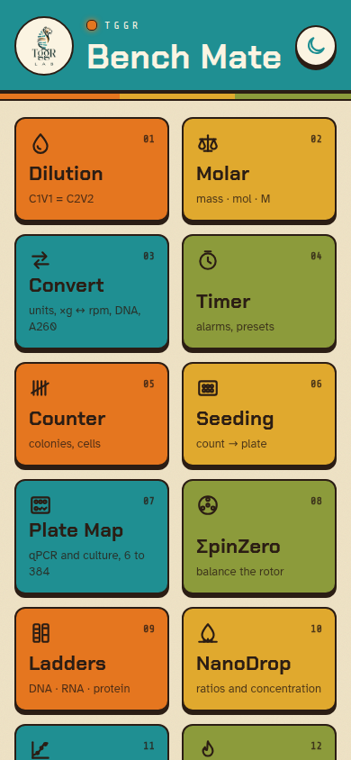
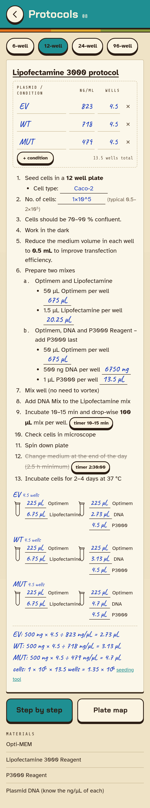

# TGGR Bench Mate

Bench tools for molecular biology, as an installable web app. Works offline. No ads, no accounts.

**App:** https://yamir-1138.github.io/benchmate/ — open on a phone and add to the home screen.

 

## Tools

Dilution · molar · unit converter (×g ↔ rpm, DNA amount, A260) · timers · counter · DNA, RNA and protein ladders · cell count to seeding · protocols as interactive worksheets · [ΣpinZero](https://github.com/YAMIR-1138/SpinZero) rotor balancing · NanoDrop reading guide · luciferase fold change · plate maps for qPCR and cell culture · BCA standard curve and plate guide · a bench log with "Add to log" on every tool and a text export for a notebook or a chat model.

## Repository

| Path | Contents |
|---|---|
| `app/` | The web app. Vite, TypeScript, no framework. |
| `core/data/` | Ladders and vessels as JSON. |
| `core/protocols/` | Protocols as Markdown. Format in [`core/protocols/README.md`](core/protocols/README.md). |
| `core/tests/vectors/` | Expected values every edition must reproduce. |
| `docs/` | Notes, hardware list for the planned ESP32 edition, screenshots. |

## Develop

```bash
cd app
npm install
npm run dev
npm test
npm run build
```

Pushes build and deploy to GitHub Pages through `.github/workflows/pages.yml`.

## Protocols

Add a Markdown file to `core/protocols/` and it appears in the app. Per-well amounts, plate formats, timers and fill-in blanks are plain text lines; see the format README.

Made at TGGR Lab with Claude Code.
